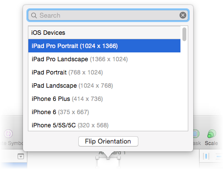

# :droplet: Fluid for Sketch 1.7

> *A collaborative project brought to you by [Matt Curtis](https://twitter.com/matt_sven) & [Cat Noone](https://twitter.com/imcatnoone)*

Fluid is a Sketch plugin that provides a means to create more constraint-based, responsive designs. It is based on Auto Layout constraints.

:package: [Download Plugin (.zip)](https://github.com/matt-curtis/Fluid-for-Sketch/releases/download/v1.7/Fluid.sketchplugin.zip) | :star: [Changelog](https://github.com/matt-curtis/Fluid-for-Sketch/releases) | :arrow_down: [Download the Demo Sketch Document](https://github.com/matt-curtis/Fluid-for-Sketch/raw/master/Constraint%20Demos.sketch)
--- | --- | ---

--

# Installation

### Method 1: Sketch Toolbox

Using [Sketch Toolbox](http://sketchtoolbox.com/), search for 'Fluid' and install. Doing so will enable you to automatically receive any updates to Fluid without having to manually do so.

### Method 2: Manually

1. Download the `.zip` above and extract it.
2. Double-click `Fluid.sketchplugin`.
3. ???
4. Profit!!!

# Updating

1. After updating Fluid (whether manually or via Sketch Toolbox) restart Sketch to receive goodness.

# Features

- Pin, Offset, Center, and Size relative to Parent Group, Parent Artboard, or Previous Sibling Layer
- Utilize simple [mathematic expressions](#mathematic-values) as values, such as `50% - 10`
- Quickly resize artboards and update their layout
- Preview, export and copy artboards at different sizes in [Preview Mode](#preview-mode)
- Constraints are stored directly on a layer, so no worries with layer names

# Usage

First and foremost, we recommend downloading the example Sketch document included in this repo (linked to it above). There are several examples included there. Examining the constraints used and playing around with the different options (i.e. Changing constraints, re-sizing artboards and pressing `Update Layout`) makes things clearer.

There are 5 primary actions: Show/Hide Toolbar, Update Layout, Edit Constraints, Preview, and Toggle Size. All of the features the plugin provides are available via `Plugins > Fluid`.

### Show/Hide Toolbar (⌃ + ⇧ + T)

For convenience, the plugin provides a toolbar that floats above the current document, giving you quick access to all of the above actions.

### Edit Constraints (⌃ + ⇧ + C)

This option shows the Constraint Inspector. Here you can edit all of the constraints for the currently selected layer.

Next to each section (Align, Fixed Size and Pinning) is a dropdown button. Pressing it opens a menu where you can set relativity:

### Update Layout (⌃ + ⇧ + L)

Adjusts the layers in the currently selected artboards to reflect your constraints.

Pressing `L` while the Constraint Inspector is focused will also Update Layout.

### Preview (⌃ + ⇧ + P)

Opens a window allowing you to preview the selected artboard at a range of preset device and icon sizes. You can also copy the preview artboard to paste into Sketch (Didn't have a mobile design? Now you do!), or export an image of the preview artboard at different scales (@1x, @2x, @3x, and so on).

### Toggle Sizes (⌃ + ⇧ + S)

Opens a popup where you can toggle the size of the current artboard between different presets, or flip its orientation.

# Additional Notes

### Fade UI
<!-- Rename to simply 'Settings' when there is more than one option... -->

You can have Fluid fade its floating UI (Inspector & Toolbar) when they are not focused. See `Plugins > Fluid > Settings`.

### Width & Height

If you have Fixed Width or Fixed Height checked, and leave the value blank, the plugin will lock the width or height to whatever the current height or width is in Sketch. This is useful in some cases where you want to ensure the height and width do not change, but don't want to enter the existing height/width manually.

### Groups

Since the width and height of Groups in Sketch are dependent on their sub-layers, Fluid does not actually resize the height or width of a group, as that causes Sketch to distort the layers within it. Rather, it simulates that sizing when calculating the geometry of sub-layers.

### Symbols

It's worth noting that while constraints you set on a Symbol *itself* will not propagate to other instances of that Symbol, any constraints you set on its *sub-layers* will.

### Text

If you set the width of a text layer but not its height, the plugin will set the height of the text layer to the height of the text after reflow.

### Mathematic Values

All of the values in Fluid support mathematic expressions, such as `20 * 2` or `(50 / 2) + 10` and so on. This becomes even more useful when you add percentages to the mix.

Percentages are relative to the dimension of the axis they're on. Here's how that shakes out:

- Using `100%` as your **fixed width** equals `100%` of the relative layer's **width**
- Using `100%` as your **fixed height** equals `100%` of the relative layer's **height**
- Using `100%` in the **top or bottom** pinnings equals `100%` of the relative layer's **height**
- Using `100%` in the **right or left** pinnings equals `100%` of the relative layer's **width**

One neat application of this is that it enables padding between sibling layers, e.g:

- Parent Group or Artboard
  - Layer B (`top pinning = 100% + 20`, `relativity = Previous Sibling (Layer A)`)
  - Layer A

### Text Field Tricks n' Tips

- Numbers in the Constraint Inspector text fields can be incremented or deincrement by 1 by pressing the up and down keys. Holding down Shift (⇧) and Up or Down will increment by 10.
- Pressing space while a text field is focused will toggle that constraint's checkbox.

### Preset Sizes

You can search through the section names of the preset sizes list (in both Preview Mode and when toggling sizes) by prefixing your searches with `s:`, i.e.: `s:iOS` or `s:Material`. Normally Fluid only searches among the preset names themselves.

# Contact

If you have any questions, comments, become attacked by technical bugs, or have ideas to improve the plugin, ping us on twitter:
[@matt_sven](http://twitter.com/matt_sven) and [@imcatnoone](http://twitter.com/imcatnoone).
