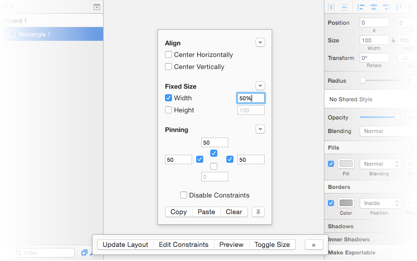
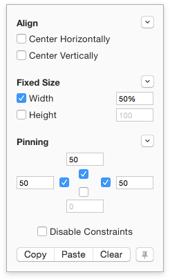
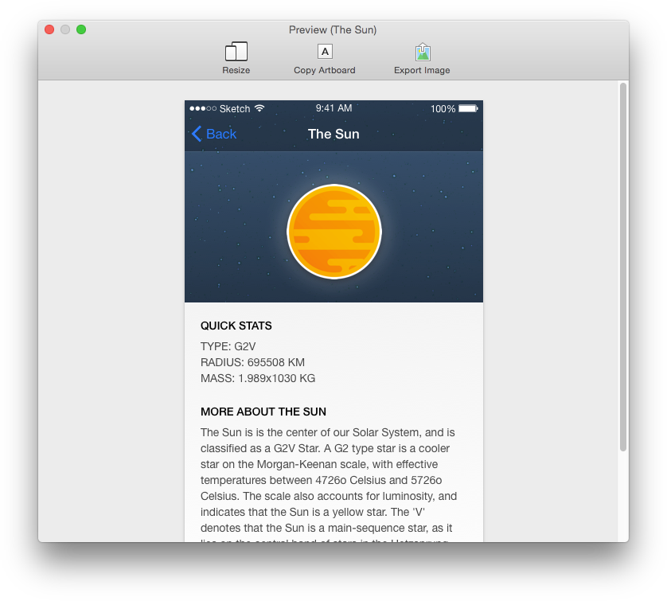

# :droplet: Fluid for Sketch 1.6.1

> *A collaborative project brought to you by [Matt Curtis](https://twitter.com/matt_sven) & [Cat Noone](https://twitter.com/imcatnoone)*

Fluid is a Sketch plugin that provides a means to create more constraint-based, responsive designs. It is based on Auto Layout constraints.

:package: [Download Plugin (.zip)](https://github.com/matt-curtis/Fluid-for-Sketch/releases/download/v1.6.1/Fluid.sketchplugin.zip) | :star: [Changelog](https://github.com/matt-curtis/Fluid-for-Sketch/releases/tag/v1.6.1) | :arrow_down: [Download the Demo Sketch Document](https://github.com/matt-curtis/Fluid-for-Sketch/raw/master/Constraint%20Demos.sketch)
--- | --- | ---

--

# Installation

> **NOTE**: For the time being, installs via Sketch Toolbox **do not work**, and you must install it manually.

1. Download the `.zip` above and extract it.
2. Double-click `Fluid.sketchplugin`.
3. ???
4. Profit!!!

# Updating

1. Restart Sketch after installing an updated `.sketchplugin`.

# Features

- Pin, Offset, Center, and Size relative to Parent Group, Parent Artboard, or Previous Sibling Layer.
- Utilize simple mathematic expressions as values, such as `50% - 10`
- View your artboards at different sizes (Mobile, Tablet, Desktop) using Preview Mode [**](#preview-mode)
- Constraints are stored directly on a layer, so no worries with layer names.

# Usage

First and foremost, we recommend downloading the example Sketch document included in this repo (linked to it above). There are several examples included there, and examining the constraints used and playing around with the different options (i.e. Changing constraints, re-sizing artboards and pressing `Update Layout`) makes things clearer.

There are 4 primary actions: Show/Hide Toolbar, Update Layout, Edit Constraints and Preview. All of the features the plugin provides are available via `Plugins > Fluid for Sketch`.

### Show/Hide Toolbar (⌃ + ⇧ + T)

For convenience, the plugin provides a toolbar that floats above the current document, giving you quick access to all of the above actions.

### Edit Constraints (⌃ + ⇧ + C)

This option shows the Constraint Inspector popup. Here you can edit all of the constraints for the currently selected layer.

Next to each section (Align, Fixed Size and Pinning) is a dropdown button. Pressing it opens a menu where you can set relativity:

### Update Layout (⌃ + ⇧ + L)

Adjusts the layers in the current artboard to reflect your constraints.

### Preview (⌃ + ⇧ + P)

Opens a window that allows you to preview the currently selected artboard at different sizes (Mobile, Tablet, Desktop). See [notes for more info](#preview-mode).

# Additional Notes

### Preview Mode

Preview Mode is rather limited at this time, as it only allows you to preview artboards at a preset number of sizes: Mobile, Tablet and Desktop. Expanding it to include more presets, custom sizes, zooming and more are WIP.

### Width & Height

If you have Fixed Width or Fixed Height checked, and leave the value blank, the plugin will lock the width or height to whatever the current height or width is in Sketch. This is useful in some cases where you want to ensure the height and width do not change. Less useful for groups, where the height and width are equal to the content (see 'Groups' below)

### Groups

Since the width and height of Groups in Sketch are dependent on their sub-layers, this plugin does not actually resize the height or width of a group, as that would distort the layers within it. Rather, it simulates that sizing when calculating the geometry of sub-layers.

### Symbols

It's worth noting that while constraints you set on a Symbol *itself* will not propagate to other instances of that Symbol, any constraints you set on its *sub-layers* will.

### Text

If you set the width of a text layer but not its height, the plugin will set the height of the text layer to the height of the text after reflow.

### Proportions (Aspect Ratio Sizing)

In order to achieve this, the easiest way is to use the aspect ratio lock in Sketch's Layer Inspector, and set your constraints to change width or height.

# Contact

If you have any questions, comments, become attacked by technical bugs, or have ideas to improve the plugin, ping us on twitter:
[@matt_sven](http://twitter.com/matt_sven) and [@imcatnoone](http://twitter.com/imcatnoone).
